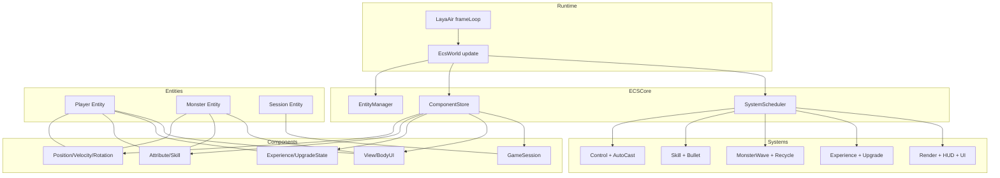
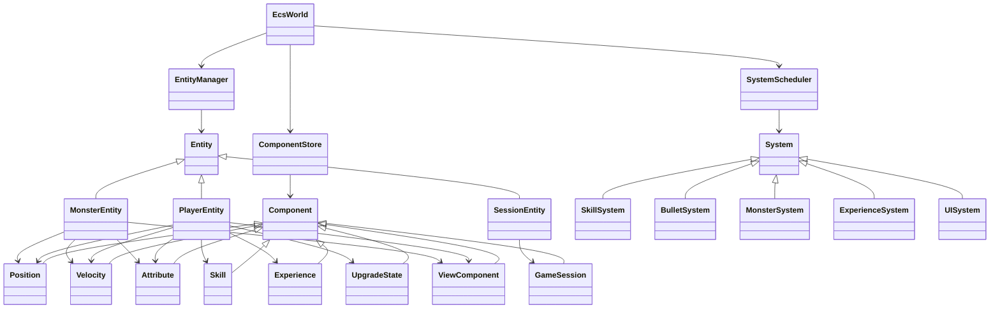
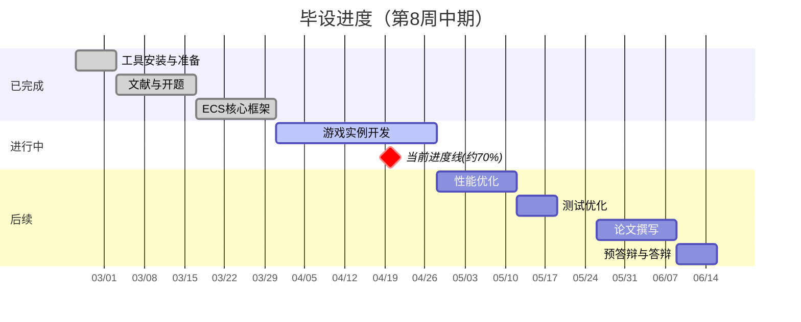
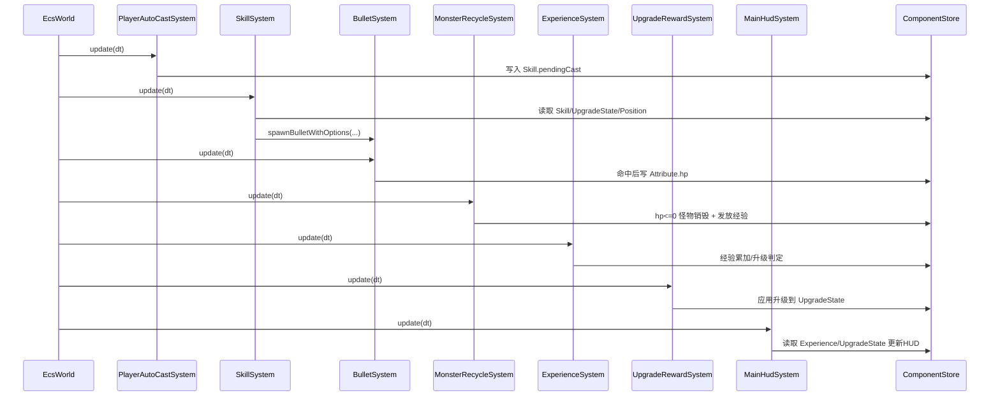

# 中期答辩文档（第8周）

题目：基于 ECS 架构的类吸血鬼幸存者游戏开发及优化  
姓名：刘瀚文  
学号：2207020509  
当前周次：第8周

---

## 第1页 封面

- 课题名称、姓名、学号、指导教师、日期
- 关键词：ECS、LayaAir、类幸存者、性能优化、配置驱动

---

## 第2页 任务书与研究背景

- **任务目标**：完成基于 ECS 的类吸血鬼幸存者游戏实例，并进行性能优化与工程化沉淀。
- **背景痛点**：
  - 传统 OOP 在高实体规模下耦合高、扩展慢。
  - 类幸存者同屏实体多、战斗节奏快、成长系统复杂。
- **课题意义**：
  - 构建可复用的 ECS 游戏框架。
  - 在 Web/H5 场景验证高并发实体更新与玩法可扩展性。

---

## 第3页 总体技术路线

---

## 第4页 当前系统架构（代码落地）

---

## 第5页 阶段计划与当前进度（第8周）

- **任务书计划（第1~8周）**
  - 第1周：基础准备与环境搭建
  - 第2~3周：文献调研、开题与外文翻译
  - 第4~5周：ECS 核心框架开发
  - 第6~9周：类幸存者游戏实例开发
- **当前判断（第8周）**
  - 已进入“游戏实例开发中后段”
  - 核心玩法闭环已打通（移动/刷怪/战斗/经验/升级/HUD/复活）
  - 尚需继续强化：升级交互 UI、性能优化实验、系统化测试

---

## 第4.5页 极简版 ECS 一帧执行图（答辩快讲版）

快讲要点（30秒）：
- 每帧由引擎驱动一次 `EcsWorld update`。  
- 调度器按组和优先级执行系统。  
- 系统只通过“组件查询”拿数据并写回组件，不直接耦合实体实现。  
- 最后由渲染/同步系统把 ECS 状态映射到画面。  

---

## 第6页 已完成工作（框架层）

- ECS 核心能力：
  - 实体生命周期管理（创建/销毁/ID复用）
  - 组件按类型存储与查询
  - 系统分组与优先级调度
- 引擎绑定：
  - ECS 到 Laya 的位置/旋转同步
  - 角色与怪物实体化（玩家/怪物均为 ECS 实体）
- UI 工程化：
  - 最小 MVC 基类与 UI 栈管理器
  - 复活面板通过 MVC + UI 栈触发

---

## 第7页 已完成工作（玩法层）

- 战斗链路：
  - 自动施法 -> 技能结算 -> 子弹生成 -> 碰撞伤害
  - 子弹配置驱动（prefab、速度、伤害、穿透、时长）
  - 子弹朝向按目标方向旋转
- 怪物系统：
  - 自动补怪（每10秒一波）
  - 怪物死亡对象池回收
  - 击杀后经验奖励
- 成长系统：
  - 等级经验条与等级文本（MainUIPanel）
  - 升级随机奖励（攻速/伤害/多发/命中分裂）
  - 稀有度与等级相关权重提升

---

## 第8页 关键逻辑流程（战斗-成长闭环）

---

## 第9页 OpenSpec 完成情况（第8周）

- `add-ecs-core-phase1`：**12/15**
- `add-battle-level-and-random-upgrades`：**6/20**
- `add-mvc-ui-stack-redpoint-pooling`：**2/11**
- `add-monster-spawn-and-movement-patterns`：**0/14**（当前实现与该提案目标存在差异，后续需对齐）

说明：已按当前代码落地情况更新上述任务勾选，未完全满足提案验收项的部分保持未勾选。

---

## 第10页 当前问题与风险

- 升级系统当前为“自动发奖”，尚未实现“3选1交互面板”。
- 怪物行为已实现基础追击与随机扰动，未完全覆盖提案中的远程绕圈与Boss状态机。
- 性能优化尚处于前置准备，缺少系统化压测报告（实体规模/FPS/内存）。
- 文档与实现存在局部偏差，后续需继续做 OpenSpec 对齐与归档。

---

## 第11页 下一步计划（第9~12周）

- **第9周（实例收口）**
  - 完成升级选择 UI（3选1）与暂停/恢复流程
  - 对齐怪物行为提案（近战/远程/Boss）
- **第10~11周（性能优化）**
  - 对象池策略细化、更新路径裁剪
  - 建立帧率/内存/实体规模的压测脚本与数据记录
- **第12周（测试优化）**
  - 功能回归、平衡性调整、稳定性修复
  - 形成可复现实验结果与测试报告

---

## 第12页 预期答辩前交付

- 可演示的完整 Demo（核心玩法 + 成长 + UI）
- OpenSpec 与实现一致性文档
- 性能优化对比结果（优化前后）
- 毕业论文初稿与中英文摘要材料

---

## 附：答辩讲解建议（每页 1~2 分钟）

- 总时长建议：12~15 分钟
- 讲述顺序：
  1) 课题与意义  
  2) 方法与架构  
  3) 已完成工作（用流程图与演示支撑）  
  4) 风险与计划  
  5) 总结与预期成果
