# 答辩 PPT 大纲（AI 生成版）

> **题目**：基于 ECS 架构的类吸血鬼幸存者游戏开发及优化（校外）  
> **项目**：Survivor And Fight  
> **技术栈**：LayaAir 3.x + TypeScript  
> **学生**：刘瀚文　｜　学号 2207020509　｜　专业：计算机科学与技术  
> **指导教师**：董玉坤　｜　中国石油大学（华东）　｜　2026 年 5 月  
> **模板文件**：`中国石油大学汇报答辩通用ppt1.pptx`  
> **插图方式**：各页 **Mermaid 源码直接嵌入**（与中期答辩文档相同；AI 工具或 mermaid.live 渲染后放入主图区）  
> **建议时长**：12–15 分钟（共 **19 页**）

---

## 一、全局生成提示（粘贴到 Gamma / Copilot / WPS AI / 通义等「整体说明」）

```
请生成本科毕业设计答辩 PPT，共 19 页，16:9（13.33×7.50 英寸），简体中文。

【模板约束】必须使用中国石油大学汇报答辩通用模板风格：
- 主色：模板自带深蓝 + 橙色强调（勿改成其他色系）
- 封面：居中大标题 + 副标题 + 两行信息区
- 目录页：六项横向/卡片式目录，每项 ≤14 字，不要英文副标题
- 正文两类版式（二选一，不可自创第三版式）：
  A)「单图版式」：标题置顶；主图占宽约 89%、高约 45%；图注一行；底部 5 条要点（每条 ≤26 字）
  B)「五环要点版式」：标题置顶；左侧半弧排列 5 条要点（每条 ≤28 字）；中间留装饰圆环
- 致谢页：「谢谢聆听」+ 三段致谢文字

【插图约束】
- 架构/流程/数据页：使用文档内给出的 Mermaid 源码渲染为图，插入主图区（89%×45%）
- 渲染方式：mermaid.live 导出 PNG/SVG，或支持 Mermaid 的 AI PPT 工具直接渲染
- 禁止引用外部截图；禁止 AI 臆造架构图
- xychart-beta 柱图用于性能数据页；flowchart/sequenceDiagram/classDiagram 用于架构流程页

【内容来源】Survivor And Fight — LayaAir 3.x + TypeScript 的 H5 2D Roguelite 生存战斗原型。
技术主线：轻量 ECS + JSON 配表技能 + MVC 全屏 UI 栈 + 对象池 + Web Worker 追逐卸载。
必须突出：五层架构、技能 effect 链、Tab 暂停装配、Level3 五波性能数据（对象池 P95 降约 36.5%）。

【排版硬约束】
- 每页要点 ≤5 条；单条 ≤28 汉字；禁止大段段落
- 关键词加粗；不要出现模板占位符（「你的标题」「Research Process」等）
- 动画：时序图/效果链允许分步出现；数据页禁止花哨动画

【页序】封面 → 目录 → 背景 → 现状 → 选型 → 需求 → 架构 → ECS → 技能链 → UI → 性能 → 场景 → 性能数据 → P95 消融 → 运行闭环 → 创新点 → 不足展望 → 总结 → 致谢
```

---

## 二、模板版式与尺寸规划（EMU 实测换算）

> 幻灯片画布：**12192000 × 6858000 EMU** = **13.33 × 7.50 in**（16:9）

| 模板页码 | 版式名称 | 适用大纲页 | 区域 | 位置（左,上） | 尺寸（宽×高） | 容量估算 |
|----------|----------|------------|------|---------------|---------------|----------|
| **slide 1** | 封面 | 第 1 页 | 主标题 | 居中偏上 | 宽约 60% × 高 5% | ≤24 字 |
| | | | 副标题 | 标题下 | 宽约 50% | ≤20 字 |
| | | | 信息行 ×2 | 页中下 | 各宽约 80% | 每行 ≤40 字 |
| **slide 2** | 六项目录 | 第 2 页 | 目录项 ×6 | 卡片/横条 | 每项宽约 15% | **每项 ≤14 字** |
| **slide 9** | 一张图片 | 第 5–11、13–15 页 | 标题 | 6.5%, 8.4% | 60.0% × 5.0% | ≤18 字 |
| | | | **主图区（Mermaid）** | 5.4%, 21.1% | **89.2% × 44.6%** | 横版 flowchart / sequence / xychart |
| | | | 图注 | 31.3%, 67.0% | 37.4% × 6.7% | ≤16 字 |
| | | | **底部要点** | 5.3%, 77.0% | **89.2% × 11.4%** | **5 条，每条 ≤26 字** |
| **slide 33** | 五环要点 | 第 3–4、12、16–18 页 | 标题 | 6.5%, 8.4% | 60.0% × 5.0% | ≤18 字 |
| | | | 要点组 ×5 | 左半弧 11.7% 起 | 每组 23.0% × 5.4% | **每条 ≤28 字** |
| **slide 4** | 致谢 | 第 19 页 | 主文案 + 正文 | 居中 | 宽约 70% | 3 段致谢 |

**Mermaid 图放入主图区的注意点**

| 图类型 | 节点上限 | 字号建议 | 不适配时的处理 |
|--------|----------|----------|----------------|
| flowchart LR | ≤8 节点 | 12–14pt | 改 TB 或减少 subgraph |
| sequenceDiagram | ≤8 参与者 | 12pt | 删 Note 细节，保留主链路 |
| classDiagram | ≤12 类 | 11pt | 改 flowchart 简图 |
| xychart-beta | ≤5 柱 | 默认 | 数据写进图注 |

---

## 三、逐页内容（19 页）

> 每页：**要点 · Mermaid 图源码 · 模板版式 · 单页 AI 提示词**  
> `[版式A]` = slide 9 单图；`[版式B]` = slide 33 五环要点

---

### 第 1 页｜封面

- **模板**：slide 1
- **主标题**：基于 ECS 架构的类吸血鬼幸存者游戏开发及优化
- **副标题**：Survivor And Fight — 毕业设计答辩
- **信息行 1**：答辩人：刘瀚文　｜　学号：2207020509　｜　计算机科学与技术
- **信息行 2**：指导教师：董玉坤　｜　中国石油大学（华东）　｜　2026 年 5 月
- **页脚关键词**：ECS · LayaAir · 类幸存者 · 数据驱动 · 性能优化
- **插图**：无（模板默认背景）
- **讲解**：30 秒

**单页 AI 提示词：**
> 中国石油大学答辩封面，16:9，模板深蓝橙配色。主标题「基于 ECS 架构的类吸血鬼幸存者游戏开发及优化」，副标题「Survivor And Fight — 毕业设计答辩」。答辩人刘瀚文，指导教师董玉坤，2026年5月。无插图，不要占位符。

---

### 第 2 页｜汇报提纲

- **模板**：slide 2
- **目录项**（每项 ≤14 字）：
  1. 研究背景与选题意义
  2. 技术路线与系统需求
  3. 总体架构与核心设计
  4. 关键模块与典型场景
  5. 性能优化与测试验证
  6. 创新点、不足与展望
- **插图**：无
- **讲解**：20 秒

---

### 第 3 页｜研究背景与意义

- **模板**：slide 33｜[版式B]
- **要点**（5 条，≤28 字）：
  - H5 链接即玩跨端，但浏览器**单主线程**限制帧预算
  - Survivor-like：自动攻击、怪潮、局内构筑 + Roguelite
  - 痛点：同屏实体多，深继承 OOP 耦合高难维护
  - 目标：验证轻量 ECS + 配表 + 池化/Worker 可落地
  - 交付：菜单→跑图→战斗→装配→死亡重启闭环

**Mermaid 图（OOP vs ECS 对比，放中央装饰区或备注）：**

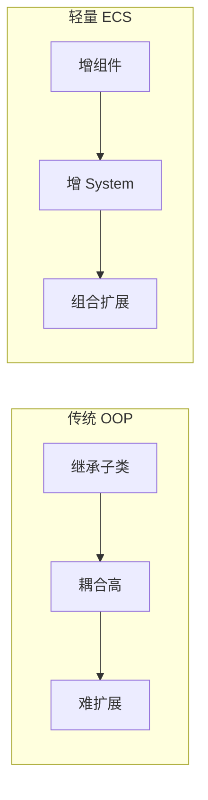

- **讲解**：1 分钟

---

### 第 4 页｜国内外研究现状

- **模板**：slide 33｜[版式B]
- **要点**（5 条）：
  - 引擎分层：Gregory 思想；Ullmann 子系统耦合与架构退化
  - ECS：组合优于继承；课设采用**轻量 Map-ECS**
  - 怪物运动：追玩家 + Boids 式排斥；非完整社会力
  - H5 性能：Worker 卸追逐/分离重算；碰撞留主线程
  - **结论**：文献支持模块化 + 重算分离 + 可验证

**Mermaid 图（文献脉络，渲染后缩入中央圆环或作备注）：**

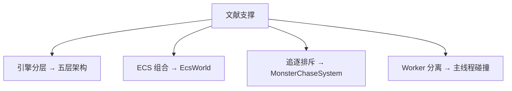

- **讲解**：50 秒

**单页 AI 提示词：**
> 答辩PPT第4页，版式B。第3条必须写清：MonsterChaseSystem 为追玩家+Boids式排斥+摆动，参考Helbing分离稳定性认识，**未实现完整社会力模型**；禁止写「融合Boids与社会力模型」。

---

### 第 5 页｜项目概述与技术选型

- **模板**：slide 9｜[版式A]
- **图注**：技术路线总览
- **要点**：
  - 浏览器端 2D 俯视角 Roguelite 生存战斗原型
  - 引擎：LayaAir 3.x + TypeScript + UI2
  - 参考：吸血鬼幸存者 + 杀戮尖塔 DAG 跑图
  - 工程：常量 defines 模块，数值 JSON 配表
  - 约束：`Laya.` 前缀；资源放 assets/

**Mermaid 图（主图区 89%×45%）：**

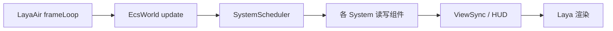

- **讲解**：1 分钟

**单页 AI 提示词：**
> 答辩PPT第5页，版式A。将上方 Mermaid 主循环流程图渲染后放入主图区（89%×45%），图注「技术路线总览」。底部5条要点≤26字。深蓝学术风。

---

### 第 6 页｜需求分析概要

- **模板**：slide 9｜[版式A]
- **图注**：玩家用例总览
- **要点**：
  - ECS、配表、跑图、Tab 装配、对象池、Worker 均已落地
  - Must：移动、自动施法、碰撞、升级奖励
  - 元游戏：DAG 跑图选关；UI 全屏栈 + Tab 装配
  - 非功能：60 FPS；数百～千怪同屏
  - 验收：MoSCoW + 需求—测试映射

**Mermaid 图：**

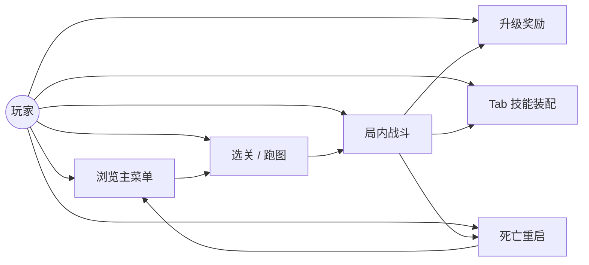

- **讲解**：1 分钟

---

### 第 7 页｜系统总体架构（五层）

- **模板**：slide 9｜[版式A]
- **图注**：系统分层架构
- **要点**：
  - 表现层：Laya 节点与 HUD
  - UI 层：UIStackManager、Controller
  - 逻辑层：SimpleEcsDemo + EcsWorld
  - 服务层：ConfigBootstrap、RunMapGenerator
  - 基础层：defines、对象池、Worker 协议

**Mermaid 图：**

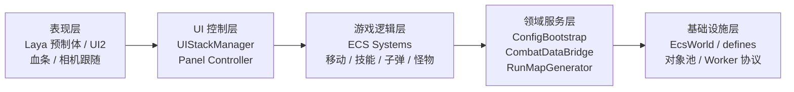

- **讲解**：1.5 分钟（答辩重点页）

---

### 第 8 页｜ECS Gameplay 设计

- **模板**：slide 9｜[版式A]
- **图注**：ECS 实体与组件绑定
- **要点**：
  - EntityId + ComponentStore（Map 存储）
  - 组件：Position、Attribute、Skill 等纯数据
  - 系统：Movement、Bullet、MonsterChase 等
  - FilterRegistry：Players / Monsters 命名筛选
  - 单线程 tick，支撑数百同屏，学习成本低

**Mermaid 图（与中期答辩 classDiagram 同风格，终稿精简版）：**

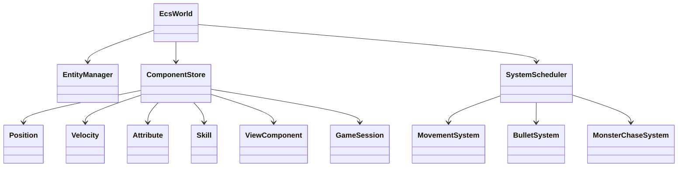

- **讲解**：1.5 分钟

---

### 第 9 页｜配表驱动与技能效果链

- **模板**：slide 9｜[版式A]
- **图注**：技能效果执行链
- **要点**：
  - tables.registry.json → ConfigBootstrap 加载
  - Skill 管冷却；SkillEffect 管效果链
  - bullet / modifier_* / direct_damage
  - modifier 行须在 bullet 行**之前**
  - FormulaParser 白名单求值，禁止 eval

**Mermaid 图：**

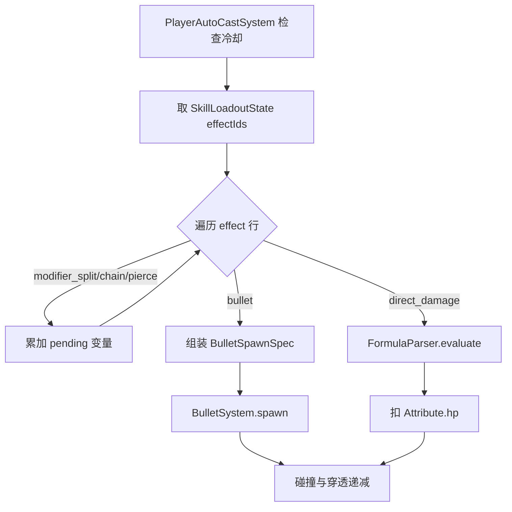

- **讲解**：1.5 分钟

---

### 第 10 页｜MVC UI 与战斗协同

- **模板**：slide 9｜[版式A]
- **图注**：Tab 技能装配时序
- **要点**：
  - Model 来自 ECS；View 管布局；Controller 管路由
  - UIStackManager 全屏栈，单页持焦
  - Tab 打开：GameSession.paused → System 早退
  - 关闭：SkillLoadoutSyncSystem 写回技能
  - SkillDragService + SkillSlotHitTest 拖拽

**Mermaid 图：**

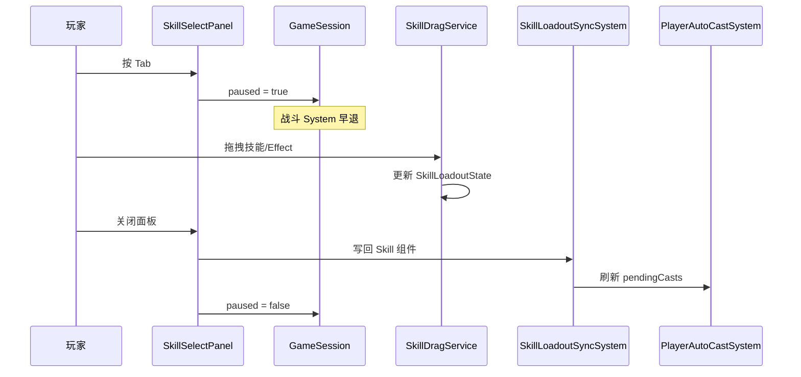

- **讲解**：1.5 分钟

---

### 第 11 页｜性能优化方案

- **模板**：slide 9｜[版式A]
- **图注**：对象池 + Worker 单帧管线
- **要点**：
  - BulletPool / MonsterPool 按预制体分桶
  - Worker 卸载追逐/分离/摆动重算
  - 失败回退 computeSync；碰撞留主线程
  - paused 时战斗 System 统一早退
  - TextureAtlasService 动态图集合批

**Mermaid 图（上下合并，答辩一页讲清）：**

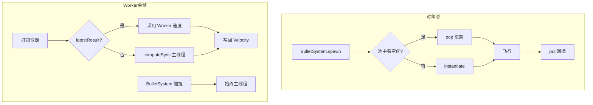

- **讲解**：2 分钟

---

### 第 12 页｜关键模块与典型场景

- **模板**：slide 33｜[版式B]
- **要点**：
  - SimpleEcsDemo 组合根注册 System 与对象池
  - 场景一：配表加载 → 元菜单 → 进战斗首帧 tick
  - 场景二：Tab 改技能 — paused 切断 tick，Sync 写回
  - 场景三：千怪波 — 快照投递 Worker / computeSync
  - 降级：配表双通道、跑图 fallback、重启防重入

**Mermaid 图（战斗-成长闭环，与中期答辩第 8 页同风格）：**

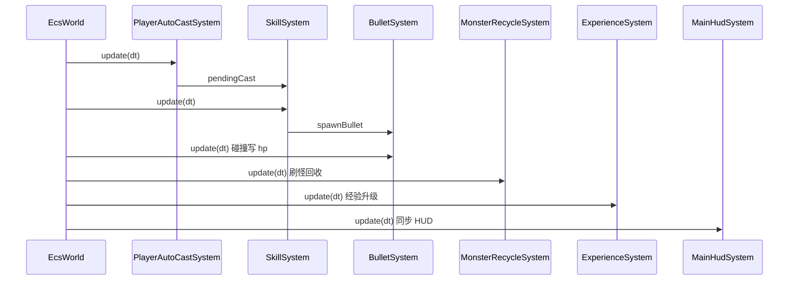

- **讲解**：1 分钟

---

### 第 13 页｜性能测试与数据解读

- **模板**：slide 9｜[版式A]
- **图注**：Level3 五波 FPS + 图集对比
- **要点**：
  - 环境：1920×1080，Level3 五波脚本
  - 10→100→1000 怪：FPS 58.62 降至 15.14
  - 图集：千怪 FPS 13.32→15.10（+13.4%）
  - 对象池：P95 76.50→48.60 ms（-36.5%）
  - 池化削尖峰；图集改善绘制

**Mermaid 图 1（五波 FPS 递进）：**

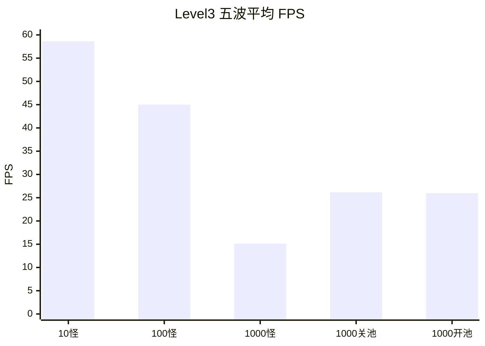

**Mermaid 图 2（图集对比，可缩入图注旁小图）：**

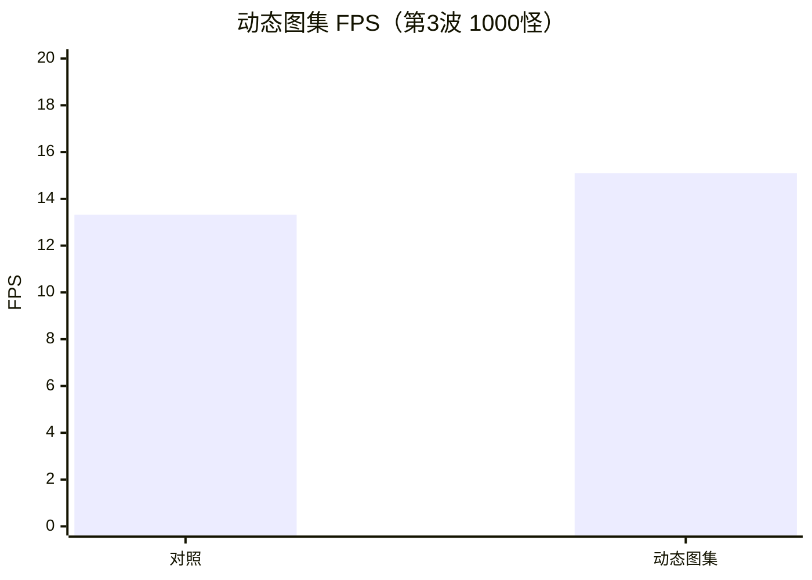

- **讲解**：1.5 分钟（数字脱口而出）

---

### 第 14 页｜对象池消融实验

- **模板**：slide 9｜[版式A]
- **图注**：P95 帧时间对比
- **要点**：
  - 第 4 波基线：关池关 Worker，P95 **76.50 ms**
  - 第 5 波仅开池：P95 **48.60 ms**
  - 均值 FPS 相近，池化主要降 GC 尖峰
  - 功能：T-F-01/05/06/09 全部通过
  - 单元：formulaParser / ecsCore / attributeModifier

**Mermaid 图：**

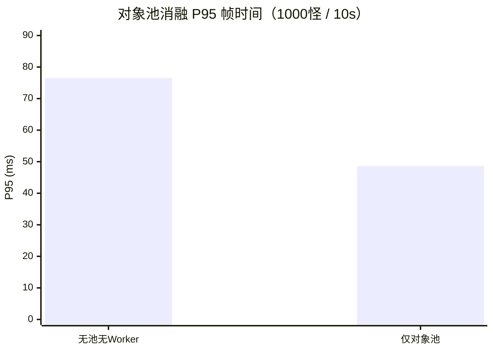

- **讲解**：1 分钟

---

### 第 15 页｜系统运行闭环

- **模板**：slide 9｜[版式A]
- **图注**：元游戏完整闭环
- **要点**：
  - 元游戏：主菜单、三幕 DAG 跑图
  - 局内：多怪弹幕、Tab 装配、升级奖励
  - 闭环：菜单→跑图→战斗→装配→死亡重启
  - Must 需求已覆盖
  - 部分 Effect 仅逻辑生效、无独立 VFX

**Mermaid 图：**

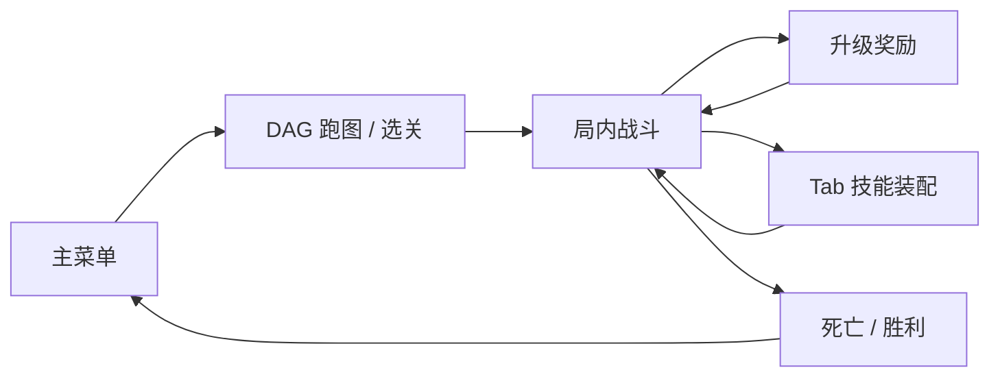

- **讲解**：1 分钟 + 建议现场演示 2～3 分钟

---

### 第 16 页｜主要创新点与工程特色

- **模板**：slide 33｜[版式B]
- **要点**：
  - 轻量 ECS：EcsWorld 驱动 tick；ViewComponent 只绑 Laya 节点
  - 性能组合拳：对象池 + Worker + 图集 + paused，均可消融
  - UI 战斗协同：全屏栈 + Tab 与 paused 统一切断
  - 数据驱动：JSON 配表 + verify 脚本 + 需求—测试追溯
  - 可靠性：配表 / Worker / 跑图均有降级路径
- **中央关键词**：H5 Roguelite 可维护原型
- **插图**：无
- **讲解**：1.5 分钟

---

### 第 17 页｜不足与展望

- **模板**：slide 33｜[版式B]
- **要点**：
  - 内容与表现：法杖三槽 UI、部分 Effect 特效/音效未补齐
  - 架构演进：Archetype/Chunk 存储；碰撞可加空间哈希
  - 测试：需 E2E UI 自动化与更长定期回归
  - 产品化：局外存档、元进度、帧率/同屏上限设置
  - 合规：虚构战斗、不采敏感数据；上网须标适龄与时长
- **插图**：无
- **讲解**：1 分钟

---

### 第 18 页｜工作总结

- **模板**：slide 33｜[版式B]
- **要点**：
  - 需求：MoSCoW + 测试映射，Must 级功能全部落地
  - 设计：五层架构 + ECS/MVC/Worker 协同设计
  - 实现：SimpleEcsDemo 组合根 + 三典型场景可演示
  - 验证：五波实验 + verify 脚本 + Mermaid/实测数据
  - 论文与源码、测试数据保持一致，可追溯
- **插图**：无
- **讲解**：1 分钟

---

### 第 19 页｜致谢

- **模板**：slide 4
- **主文案**：谢谢聆听
- **正文**：
  - 感谢指导教师董玉坤老师在选题、架构与写作上的指点
  - 感谢学院师长、同学与家人的支持
  - 请各位老师批评指正
- **备注小字**（不念）：ECS vs OOP；Worker 为何不包碰撞；P95 含义；配表同步
- **插图**：无
- **讲解**：30 秒

---

## 四、讲解节奏建议

| 阶段 | 页码 | 建议时长 |
|------|------|----------|
| 开场 | 1～2 | 1 min |
| 背景与现状 | 3～4 | 1.5～2 min |
| 选型与需求 | 5～6 | 2 min |
| 架构与 ECS | 7～8 | 3 min |
| 技能链 / UI / 性能 | 9～11 | 4～5 min |
| 场景 | 12 | 1 min |
| 性能数据 | 13～14 | 2.5 min |
| 闭环 + 演示 | 15 | 2～3 min |
| 创新 / 不足 / 总结 | 16～18 | 3 min |
| 致谢 | 19 | 0.5 min |
| **合计** | **19** | **12～15 min** |

---

## 五、Mermaid 图索引（按大纲页码）

| 页码 | 图类型 | 图题 |
|------|--------|------|
| 3 | flowchart LR | OOP vs ECS 对比 |
| 4 | flowchart TB | 文献脉络四条线 |
| 5 | flowchart LR | 主循环技术路线 |
| 6 | flowchart LR | 玩家用例总览 |
| 7 | flowchart LR | 系统五层架构 |
| 8 | classDiagram | ECS 核心类关系 |
| 9 | flowchart TD | 技能效果执行链 |
| 10 | sequenceDiagram | Tab 装配时序 |
| 11 | flowchart TD | 对象池 + Worker 管线 |
| 12 | sequenceDiagram | 战斗-成长一帧闭环 |
| 13 | xychart-beta ×2 | 五波 FPS + 图集对比 |
| 14 | xychart-beta | P95 消融柱图 |
| 15 | flowchart LR | 元游戏完整闭环 |

---

## 六、单页生成通用模板（复制后替换 `{}`）

```
请生成答辩 PPT 单页，16:9，中国石油大学模板深蓝橙学术风。
页码：第 {N} 页
版式：{A=单图+底部5要点 | B=五环要点}
标题：{标题，≤18字}
正文要点（每条≤{26|28}字，共≤5条）：
{要点列表}
Mermaid 主图（渲染后放入 89%×45% 主图区）：
```mermaid
{粘贴对应页 Mermaid 源码}
```
图注：{≤16字}
禁止：外部截图、大段段落、英文占位符、超过5条要点
```

---

## 七、评委高频问题 → 跳转页

| 可能问题 | 回答要点 | 跳转页 |
|----------|----------|--------|
| ECS 与 OOP 相比优势？ | 组合扩展、Filter 批量查询、数据与逻辑分离 | 3、8 |
| Worker 做了什么、没做什么？ | 只卸追逐/分离/摆动；碰撞与渲染在主线程 | 11 |
| 对象池为何几乎不抬均值 FPS？ | 主要减少 GC **尖峰**，P95 降 36.5% | 13～14 |
| Tab 暂停如何实现？ | `GameSession.paused` + 各 System 早退 | 10 |
| 配表加载失败怎么办？ | `isGameConfigReady` + 默认配置回退 | 12 |
| 与 Unity DOTS 区别？ | 轻量单线程 Map ECS，数百实体级 | 8 |
| 做了 Boids/社会力模型吗？ | 追玩家 + Boids 式排斥 + 摆动；非完整 Boids/Helbing 社会力 | 4、11 |
| 创新点是什么？ | 五条：轻量 ECS、性能组合拳、UI 协同、数据驱动、可靠性 | 16 |

---

*版式尺寸依据 `中国石油大学汇报答辩通用ppt1.pptx` 占位符实测；插图均为文档内嵌 Mermaid 源码，渲染方式与中期答辩文档一致。*
