# 答辩 PPT 大纲（AI 生成版）

> **题目**：基于 ECS 架构的类吸血鬼幸存者游戏开发及优化（校外）  
> **项目**：Survivor And Fight  
> **技术栈**：LayaAir 3.x + TypeScript  
> **学生**：刘瀚文　｜　学号 2207020509　｜　专业：计算机科学与技术  
> **指导教师**：董玉坤　｜　中国石油大学（华东）　｜　2026 年 5 月  
> **模板文件**：`中国石油大学汇报答辩通用ppt1.pptx`  
> **插图方式**：各页 **Mermaid 源码直接嵌入**（与中期答辩文档相同；AI 工具或 mermaid.live 渲染后放入主图区）  
> **建议时长**：12–15 分钟（共 **21 页**）

---

## 一、全局生成提示（粘贴到 Gamma / Copilot / WPS AI / 通义等「整体说明」）

```
请生成本科毕业设计答辩 PPT，共 21 页，16:9（13.33×7.50 英寸），简体中文。

【模板约束】必须使用中国石油大学汇报答辩通用模板风格：
- 主色：模板自带深蓝 + 橙色强调（勿改成其他色系）
- 封面：居中大标题 + 副标题 + 两行信息区
- 目录页：六项横向/卡片式目录，每项 ≤14 字，不要英文副标题
- 正文三类版式（按页选用，不可自创第四版式）：
  A)「单图版式」：标题；上部 1～2 句引导语（讲流程）；主图 89%×45%；图注一行；底部 3～5 条解读要点
  B)「五环要点版式」：标题；左侧半弧 5 条要点；中间装饰圆环；无大图
  C)「纯文字版式」：标题；上部 2 句总述；中部 5 条叙述性要点（每条 30～45 字，讲业务流）；底部 1 句收束；**禁止插图**

【写作原则 — 最重要】
- 用「玩家做什么 → 系统怎么响应 → 画面/数据如何变化」讲清流程
- 少堆类名/文件名；必要技术词首次出现可加括号注释
- 禁止：融合 Boids 与社会力模型、海量自然群体仿真等夸大表述
- 怪物运动准确表述：追玩家 + Boids 式邻域排斥 + 摆动；非完整社会力模型
- 每页只讲一个核心观点；禁止大段复制论文段落

【插图约束】
- 仅使用文档内给出的 Mermaid 源码渲染后插入主图区
- 禁止引用外部截图；禁止 AI 臆造架构图
- xychart-beta 用于性能数据；flowchart/sequenceDiagram/classDiagram 用于流程页

【内容来源】Survivor And Fight — H5 2D Roguelite 生存战斗原型。
技术主线：轻量 ECS + JSON 配表技能 + MVC 全屏 UI 栈 + 对象池 + Worker 追逐卸载。
必须突出：五层架构（1 页文字 + 2 页图）、跑图→战斗→装配闭环、技能 effect 链、Level3 五波数据（P95 降约 36.5%）。

【页序】
封面 → 目录 → 背景 → 技术选型 → 架构文字 → 架构分层图 → 架构主循环图
→ ECS 流程文字 → ECS 结构图 → 配表流程文字 → 配表效果图
→ UI 协同 → 性能优化 → 战斗时序 → 性能数据 → P95 消融 → 元游戏闭环
→ 创新点 → 不足展望 → 总结 → 致谢
```

---

## 二、模板版式与尺寸规划（EMU 实测换算）

> 幻灯片画布：**12192000 × 6858000 EMU** = **13.33 × 7.50 in**（16:9）

| 模板页码 | 版式名称 | 适用大纲页 | 区域 | 位置（左,上） | 尺寸（宽×高） | 容量估算 |
|----------|----------|------------|------|---------------|---------------|----------|
| **slide 1** | 封面 | 第 1 页 | 主标题 | 居中偏上 | 宽约 60% × 高 5% | ≤24 字 |
| **slide 2** | 六项目录 | 第 2 页 | 目录项 ×6 | 卡片/横条 | 每项宽约 15% | **每项 ≤14 字** |
| **slide 9** | 一张图片 | 单图页 | 标题 | 6.5%, 8.4% | 60.0% × 5.0% | ≤18 字 |
| | | | 引导语 | 5.3%, 12% | 89.2% × 8% | 1～2 句，≤60 字 |
| | | | **主图区（Mermaid）** | 5.4%, 21.1% | **89.2% × 44.6%** | flowchart / sequence / xychart |
| | | | 图注 | 31.3%, 67.0% | 37.4% × 6.7% | ≤20 字 |
| | | | **底部解读** | 5.3%, 72% | **89.2% × 14%** | 3～5 条，每条 ≤30 字 |
| **slide 33** | 五环要点 | 纯文字/总结页 | 标题 | 6.5%, 8.4% | 60.0% × 5.0% | ≤18 字 |
| | | | 叙述要点 ×5 | 左半弧 11.7% 起 | 每组 23.0% × 6% | **每条 30～45 字** |
| **slide 4** | 致谢 | 第 21 页 | 主文案 + 正文 | 居中 | 宽约 70% | 3 段致谢 |

**版式选用速查**

| 版式 | 代号 | 何时用 |
|------|------|--------|
| 单图 | A | 需要 Mermaid 主图的技术页 |
| 五环 | B | 背景、创新、不足、总结等无大图页 |
| 纯文字 | C | 架构总述、ECS/配表流程讲解等「先讲清再上图」的前导页 |

---

## 三、逐页内容（21 页）

> 每页含：**叙述要点 · Mermaid（若有）· 版式 · 单页 AI 提示词**  
> 写作风格：**流程优先**，用玩家路径与系统行为串联，避免只列代码标识符。

---

### 第 1 页｜封面

- **模板**：slide 1
- **主标题**：基于 ECS 架构的类吸血鬼幸存者游戏开发及优化
- **副标题**：Survivor And Fight — 毕业设计答辩
- **信息行 1**：答辩人：刘瀚文　｜　学号：2207020509　｜　计算机科学与技术
- **信息行 2**：指导教师：董玉坤　｜　中国石油大学（华东）　｜　2026 年 5 月
- **讲解**：30 秒

**单页 AI 提示词：**
> 中国石油大学答辩封面，深蓝橙配色。主标题与副标题如上，答辩人刘瀚文，指导教师董玉坤，2026年5月。无插图。

---

### 第 2 页｜汇报提纲

- **模板**：slide 2
- **目录项**（每项 ≤14 字）：
  1. 研究背景与选题意义
  2. 技术路线与总体架构
  3. ECS 玩法与配表战斗
  4. UI 协同与性能优化
  5. 测试验证与运行闭环
  6. 创新点、不足与展望
- **讲解**：20 秒

---

### 第 3 页｜研究背景与意义

- **模板**：slide 33｜[版式B]
- **要点**（叙述性，≤45 字/条）：
  - H5 链接即玩，但浏览器单主线程使「怪潮 + 弹幕」帧预算紧张
  - 类吸血鬼幸存者：自动施法、密集敌群、局内构筑；参考杀戮尖塔式 DAG 跑图
  - 深继承 OOP 难扩展：新技能/新怪常改整条继承链，同屏实体一多就难维护
  - 课题目标：用轻量 ECS + JSON 配表 + 池化/Worker，做出可演示可测的原型
  - 交付标准：主菜单 → 三幕跑图选关 → 局内战斗 → Tab 改技能 → 死亡重启闭环
- **讲解**：1 分钟

**单页 AI 提示词：**
> 版式B，标题「研究背景与意义」。5条要点讲痛点与目标，用业务语言，不要文献综述列表。

---

### 第 4 页｜项目概述与技术选型

- **模板**：slide 9｜[版式A]
- **引导语**：本项目是浏览器端 2D 俯视角 Roguelite 原型：玩家从主菜单进入跑图，选关后进入俯视角生存战斗，击杀升级并可用 Tab 调整技能，死亡后回到菜单重来。
- **图注**：图1  引擎主循环：逻辑 tick 与画面渲染分离
- **解读要点**：
  - 引擎 LayaAir 3.x + TypeScript，UI 采用 UI2 组件
  - 玩法参考吸血鬼幸存者战斗节奏 + 杀戮尖塔式 DAG 跑图
  - 工程常量集中 defines 模块；战斗数值走 JSON 配表
  - 每帧先跑 ECS 逻辑，再由引擎绘制与响应 UI
  - 资源与预制体统一放 assets/，引擎 API 使用 Laya. 前缀

**Mermaid 图：**

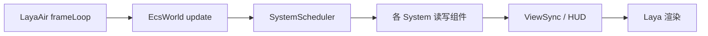

- **讲解**：1 分钟

**单页 AI 提示词：**
> 版式A。上部用1～2句说明「菜单→跑图→战斗→装配→重启」玩家路径。主图渲染上方 Mermaid 主循环。底部解读讲技术选型，不要只写类名。

---

### 第 5 页｜系统总体架构（文字总述）

- **模板**：slide 33｜[版式C 纯文字]
- **引导语（2 句）**：系统按「上层只依赖下层」划分为五层，把画面、界面、玩法逻辑、领域服务与底层设施拆开。这样跑图、战斗、配表加载各自归属清晰，后续加技能或加优化不会牵一发而动全身。
- **叙述要点**（5 条，讲职责与数据流，非类名清单）：
  - **表现层**：负责血条、怪物预制体、相机跟随等「看得见」的部分，只根据数据层状态刷新画面
  - **UI 控制层**：主菜单、跑图界面、技能面板、升级弹窗等全屏页，用栈管理打开/关闭与输入焦点
  - **游戏逻辑层**：每帧 ECS 调度——移动、自动施法、子弹碰撞、刷怪回收、经验升级等核心玩法在此运转
  - **领域服务层**：启动时加载 JSON 配表；生成三幕 DAG 跑图；战斗帧把坐标快照交给 Worker 计算追逐
  - **基础设施层**：实体与组件存储、对象池复用节点、Worker 通信协议、全局常量与降级开关
- **收束句**：五层自上而下调用，逻辑层不直接操作 DOM，UI 打开战斗暂停时逻辑层统一早退。
- **插图**：无
- **讲解**：1.5 分钟（架构第一节，答辩重点）

**单页 AI 提示词：**
> 版式C纯文字，标题「系统总体架构」。禁止插图。5条要点分别解释五层「做什么、不做什么」，用跑图/战斗/配表举例，不要罗列文件名。

---

### 第 6 页｜系统总体架构（五层分层）

- **模板**：slide 9｜[版式A]
- **引导语**：下图把五层依赖画成单向箭头：表现在最上，基础设施在最下；改 UI 不必改子弹碰撞，改配表不必改引擎渲染。
- **图注**：图2  五层架构与依赖方向
- **解读要点**：
  - 表现层只消费逻辑层产出的位置、血量等数据
  - UI 层通过暂停标记切断战斗 tick，避免面板打开仍被攻击
  - 逻辑层集中所有 ECS 系统，是玩法「唯一真相源」
  - 服务层承接配表、跑图生成、战斗快照桥接
  - 基础层提供池化与 Worker，支撑千怪级压力场景

**Mermaid 图：**

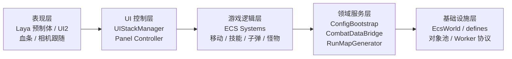

- **讲解**：1 分钟

---

### 第 7 页｜系统总体架构（Gameplay 总览）

- **模板**：slide 9｜[版式A]
- **引导语**：从数据到战斗的横向切面：配表与组件是「真相」，系统层只改字段；怪物多时战斗准备系统把坐标送 Worker 算追逐，子弹碰撞仍回主线程读场景节点。
- **图注**：图3  Gameplay 层：数据、系统、战斗桥接与暂停
- **解读要点**：
  - 玩家与怪物靠标签区分，筛选器按「玩家组/怪物组」批量处理
  - 配表驱动技能效果，系统无状态，便于增删玩法模块
  - 暂停时（Tab/死亡/胜利）整帧战斗逻辑跳过，UI 仍可操作
  - Worker 只卸追逐/分离/摆动；碰撞依赖引擎节点必须在主线程
  - 扩展新能力 = 增组件或增系统，而非改怪物继承树

**Mermaid 图：**

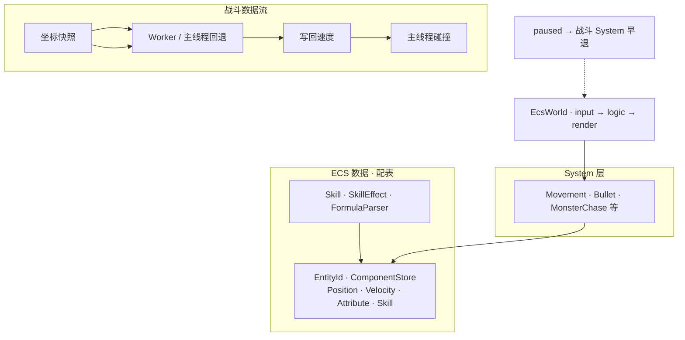

- **讲解**：1 分钟

---

### 第 8 页｜ECS 玩法设计（流程说明）

- **模板**：slide 33｜[版式C 纯文字]
- **引导语（2 句）**：ECS 在本项目中不是抽象概念，而是贯穿「进战斗 → 每帧 tick → 死亡重启」的具体机制：实体只是编号，能力靠挂载组件表达，每帧由系统批量读写组件字段。
- **叙述要点**（按玩家旅程组织）：
  - **进战斗前**：主菜单点「开始」→ 跑图生成器产出三幕 DAG → 玩家沿已解锁边选关 → 进入战斗场景时创建玩家实体并注册全部战斗系统
  - **战斗每帧**：调度器按优先级依次执行——玩家移动与自动施法、技能冷却、子弹飞行与碰撞、怪物追逐与刷怪、经验结算与 HUD 同步
  - **实体构成**：玩家有位置/速度/属性/技能栏；怪物有位置/速度与怪物定义；全局会话实体保存「是否暂停、是否重启中」等局内状态
  - **画面同步**：逻辑只改数字，专门的同步系统把坐标与血量映射到 Laya 节点，避免在技能代码里直接操作显示对象
  - **跑图与战斗切换**：跑图阶段走 UI 控制器；进入战斗后 UI 栈清空战斗 HUD，ECS 世界接管；Tab 打开技能面板时全局暂停，关闭后把栏位写回玩家技能组件
- **收束句**：单线程 Map 存储，数百～千怪同屏可跑；学习成本低于商业 DOTS，适合作业级原型验证。
- **插图**：无
- **讲解**：1.5 分钟

**单页 AI 提示词：**
> 版式C，标题「ECS 玩法设计」。按「进战斗前→每帧→画面→跑图切换」讲流程，类名最多点到为止，重点让评委听懂玩家路径。

---

### 第 9 页｜ECS 玩法设计（结构关系）

- **模板**：slide 9｜[版式A]
- **引导语**：下图说明「一个怪物实体」如何同时携带位置数据、属性数据与显示绑定；系统不继承怪物基类，而是遍历「所有带位置+速度的怪物」统一处理。
- **图注**：图4  实体、组件与系统的绑定关系
- **解读要点**：
  - 实体 ID 唯一标识场景中的一个角色或会话
  - 组件是纯数据：坐标、速度、血量、技能冷却、显示节点引用
  - 移动/子弹/追逐等系统按筛选规则取实体列表后批量更新
  - 玩家与怪物共享位移与属性组件，仅身份标签不同
  - 组合优于继承：新怪 = 换预制体 + 换配表行，不必写子类

**Mermaid 图：**

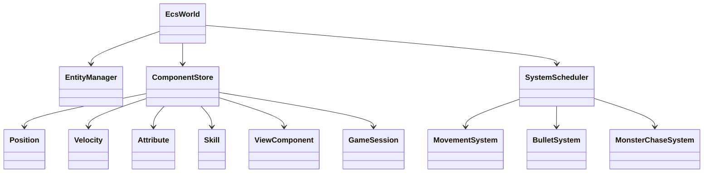

- **讲解**：1 分钟

---

### 第 10 页｜配表驱动战斗（流程说明）

- **模板**：slide 33｜[版式C 纯文字]
- **引导语（2 句）**：技能伤害、冷却、子弹形态、穿透与分裂等数值全部在 JSON 配表里，程序只负责「按表执行」。策划改 JSON 即可调平衡，不必改 TypeScript 战斗代码。
- **叙述要点**：
  - **启动加载**：游戏启动先读注册表索引，再按表名拉取技能/效果/怪物等 JSON；网络 fetch 失败时自动改用引擎本地加载，加载失败则回退默认配置保证能进游戏
  - **技能栏位**：玩家最多装备若干技能；每个技能指向多条「效果行」，行类型包括：改子弹参数（分裂/连锁/穿透）、生成子弹、直接扣血
  - **施法一帧**：自动施法系统检查冷却 → 读取当前栏位的效果 ID 列表 → 按顺序执行每一行 → 先累加修饰变量，再生成子弹或直接结算伤害
  - **公式安全**：伤害公式用白名单解析器计算，禁止 eval，避免配表被篡改时执行任意脚本
  - **与画面关系**：部分效果目前只有逻辑结果（如直接伤害），尚未全部绑定独立特效；但数值与命中判定已可玩
- **收束句**：配表—执行器—战斗系统三段式，是本项目「数据驱动」的核心。
- **插图**：无
- **讲解**：1.5 分钟

**单页 AI 提示词：**
> 版式C，标题「配表驱动战斗」。讲「启动加载→栏位→施法一帧→公式安全」，用玩家能感知的效果描述，不要贴 JSON 字段名清单。

---

### 第 11 页｜配表驱动战斗（效果执行链）

- **模板**：slide 9｜[版式A]
- **引导语**：下图是一次自动施法内部发生的事：先处理分裂/穿透等修饰，再真正生成子弹；直接伤害类效果走公式扣血，最后统一进入碰撞与穿透递减。
- **图注**：图5  技能效果链：冷却 → 遍历效果行 → 子弹/伤害
- **解读要点**：
  - 修饰行必须在子弹行之前，否则穿透/分裂参数来不及注入
  - 子弹行组装发射参数后交给子弹系统从对象池取节点
  - 直接伤害行跳过飞行物，对范围内目标扣血
  - 同一技能多行效果可组合出「先分裂再发射」类构筑
  - 全流程可由 verify 脚本对照配表做回归检查

**Mermaid 图：**

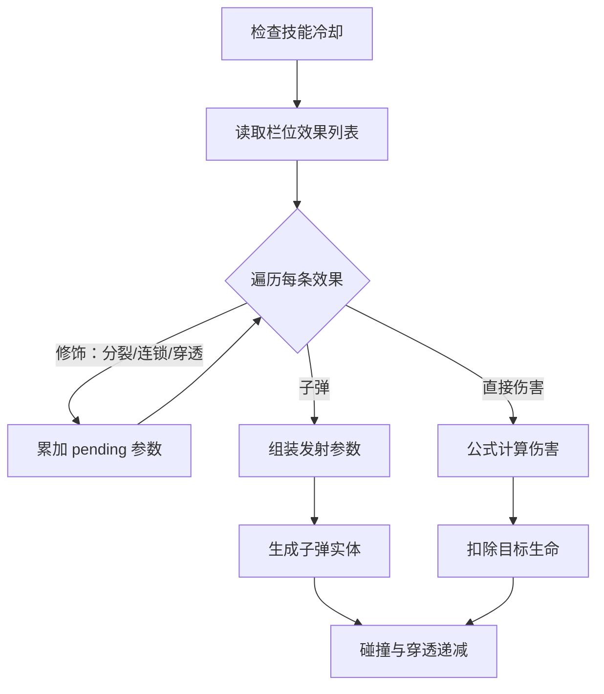

- **讲解**：1 分钟

---

### 第 12 页｜UI 与战斗协同（Tab 装配）

- **模板**：slide 9｜[版式A]
- **引导语**：局内按 Tab 打开技能面板时，战斗并未「后台继续」——全局暂停标记让怪物停止移动、子弹停止结算；玩家在面板里拖拽技能，关闭后才写回 ECS 并恢复战斗。
- **图注**：图6  Tab 打开：暂停 → 拖拽改栏位 → 写回 → 恢复
- **解读要点**：
  - 界面分视图（布局）与控制器（打开/关闭/路由），数据来自 ECS 组件
  - 全屏 UI 用栈管理，同时只一个战斗相关面板持焦
  - 拖拽只改临时栏位对象，避免误触直接改战斗实体
  - 关闭面板时同步系统把栏位写回玩家技能组件，自动施法下一帧生效
  - 输入层与战斗逻辑层分离：面板打开时指针给 UI，战斗 tick 不跑

**Mermaid 图：**

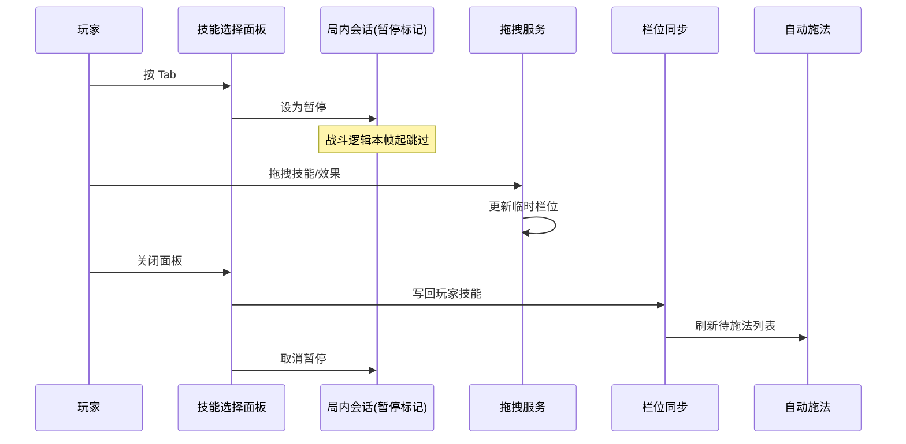

- **讲解**：1.5 分钟

---

### 第 13 页｜性能优化方案

- **模板**：slide 9｜[版式A]
- **引导语**：H5 生存战斗的瓶颈在「大量怪物追逐 + 大量子弹创建 + 绘制调用」。本项目用对象池减 GC 尖峰、Worker 卸追逐重算、动态图集减 DrawCall，并用暂停早退避免无效计算。
- **图注**：图7  对象池复用与 Worker 单帧管线
- **解读要点**：
  - 子弹/怪物按预制体分桶：取出重置、回收复用，少做 instantiate/destroy
  - 场上实体达标后，每帧打包坐标送 Worker 算追逐/排斥/摆动；失败则主线程同公式补算
  - 子弹碰撞必须读 Laya 节点与阵营，始终留主线程
  - 技能面板/死亡/胜利时战斗系统入口直接返回，不白跑 AI
  - 千怪场景开启动态图集，实测 FPS 有约 13% 提升

**Mermaid 图：**

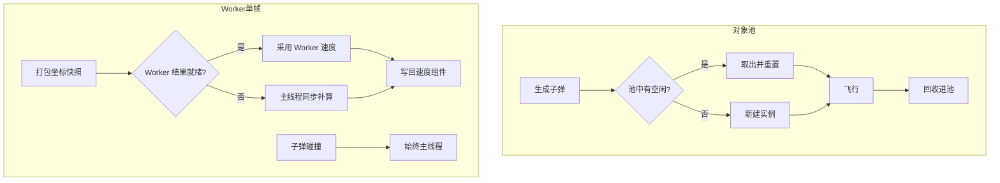

- **讲解**：1.5 分钟

---

### 第 14 页｜局内战斗一帧时序

- **模板**：slide 9｜[版式A]
- **引导语**：从应用启动到死亡重启的纵向时序：配表就绪后才能进战斗；战斗帧里先准备 Worker 数据再跑各系统；Tab 与死亡都会打断 tick。
- **图注**：图8  启动 → 进战斗 → 帧循环 → Tab → 重启
- **解读要点**：
  - 启动：加载配表 → 主菜单 → 跑图选关 → 初始化 ECS 与对象池
  - 战斗帧：自动施法 → 技能/子弹 → 碰撞 → 刷怪回收 → 经验 → HUD
  - 高负载时 Worker 支路与主线程碰撞支路并行分工
  - Tab 段：暂停 → 改技能 → 写回 → 恢复
  - 死亡：弹出重启面板，防重复清场后回菜单

**Mermaid 图：**

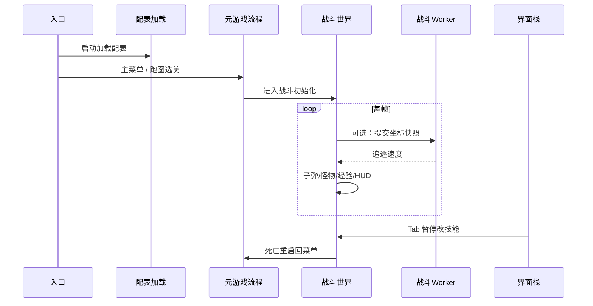

- **讲解**：1 分钟

---

### 第 15 页｜性能测试与数据解读

- **模板**：slide 9｜[版式A]
- **引导语**：Level3 脚本分五波加压：10 → 100 → 1000 怪观察 FPS 变化；第 3 波对比动态图集；第 4～5 波做对象池消融看 P95 帧时间。
- **图注**：图9  Level3 五波平均 FPS
- **解读要点**：
  - 环境 1920×1080，固定五波刷怪脚本
  - 10 怪约 58 FPS；1000 怪降至约 15 FPS，为优化靶点
  - 千怪开图集：13.32 → 15.10 FPS（+13.4%）
  - 对象池主要降 P95 尖峰，均值 FPS 变化不大
  - 功能用例 T-F-01/05/06/09 全部通过

**Mermaid 图：**

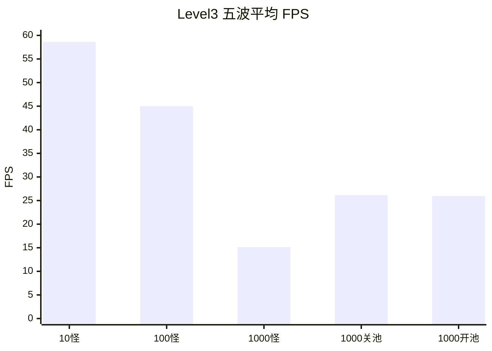

- **讲解**：1.5 分钟（关键数字脱口而出）

---

### 第 16 页｜对象池消融实验

- **模板**：slide 9｜[版式A]
- **引导语**：第 4 波关池关 Worker 作基线，第 5 波只开对象池；两者均值 FPS 接近，但最坏帧（P95）明显下降，说明池化主要削 GC 尖峰而非抬高平均帧率。
- **图注**：图10  对象池消融 P95 帧时间（1000 怪 / 10s）
- **解读要点**：
  - 基线 P95：**76.50 ms**
  - 仅开池 P95：**48.60 ms**（约 **-36.5%**）
  - 解释：少分配/少回收 → 少触发垃圾回收卡顿
  - 单元测试覆盖公式解析、ECS 核心、属性修饰
  - 与论文第 6 章数据一致，可追溯

**Mermaid 图：**

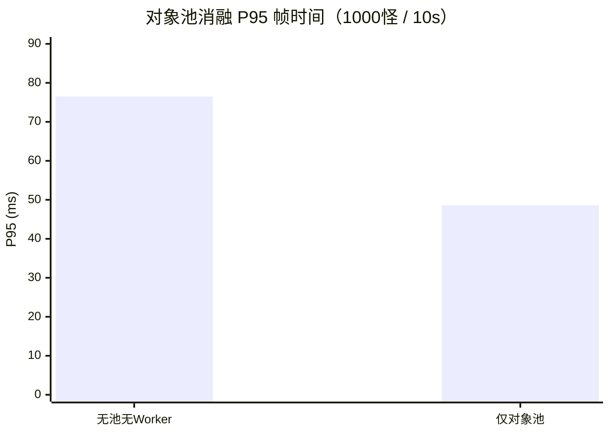

- **讲解**：1 分钟

---

### 第 17 页｜元游戏运行闭环

- **模板**：slide 9｜[版式A]
- **引导语**：整局体验是「菜单 → 三幕 DAG 跑图选关 → 俯视角生存战斗 → 升级奖励 / Tab 改技能 → 死亡或胜利回菜单」，Must 级玩法均已覆盖。
- **图注**：图11  元游戏 + 局内战斗闭环
- **解读要点**：
  - 跑图：每局随机 DAG，只能走已解锁邻接边；失败多次有线性 fallback 图
  - 局内：自动攻击、怪潮、拾取经验升级
  - Tab：随时暂停改构筑，不打断 UI 操作安全性
  - 死亡：重启面板回主菜单，会话防重入
  - 部分效果尚无独立 VFX，逻辑与数值已生效

**Mermaid 图：**

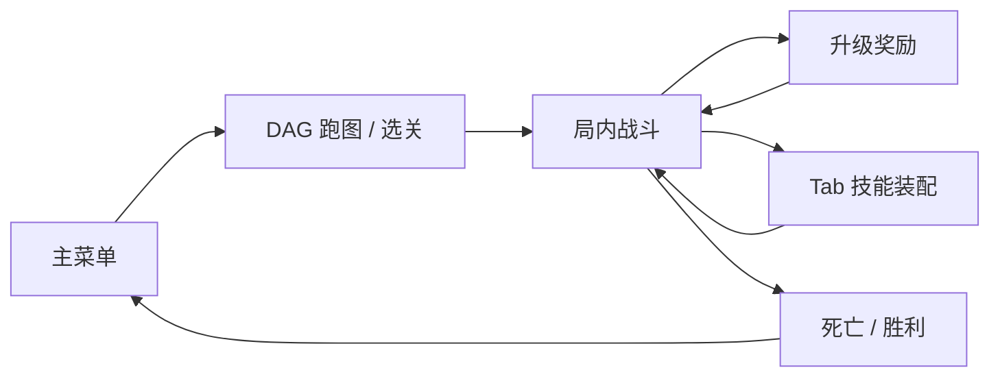

- **讲解**：1 分钟 + 建议现场演示 2～3 分钟

---

### 第 18 页｜主要创新点与工程特色

- **模板**：slide 33｜[版式B]
- **要点**（叙述性）：
  - 轻量 ECS：单线程 Map 存储，跑图/战斗/装配共用同一套实体模型，维护成本低于深继承 OOP
  - 性能组合拳：池化 + Worker + 图集 + 暂停早退，均可单独开关做消融验证
  - UI 战斗协同：Tab 与死亡共用暂停标记，全屏栈保证输入不穿透战斗层
  - 数据驱动：JSON 配表 + 白名单公式 + verify 脚本，数值改动不重新编译
  - 可靠性：配表双通道加载、Worker 失败主线程回退、跑图生成失败 fallback
- **中央关键词**：H5 Roguelite 可维护原型
- **讲解**：1.5 分钟

---

### 第 19 页｜不足与展望

- **模板**：slide 33｜[版式B]
- **要点**：
  - 表现：法杖三槽 UI、部分技能特效/音效未补齐
  - 架构：可演进 Archetype/Chunk；怪物碰撞可加空间哈希降 O(n²)
  - 怪物 AI：当前为追逐+排斥+摆动，非完整人群仿真模型
  - 测试：需 E2E UI 自动化与更长定期回归
  - 产品化：局外存档、元进度、帧率/同屏上限与合规提示
- **讲解**：1 分钟

---

### 第 20 页｜工作总结

- **模板**：slide 33｜[版式B]
- **要点**：
  - 完成 H5 Roguelite 原型：菜单—跑图—战斗—装配—重启全链路可演示
  - 五层架构 + ECS 玩法 + 配表 effect 链 + MVC UI 协同已落地
  - Level3 五波压测与对象池消融数据支撑论文结论
  - 源码、配表、测试脚本与论文表述保持一致可追溯
  - 为同类 H5 生存游戏提供可复用的工程化参考
- **讲解**：1 分钟

---

### 第 21 页｜致谢

- **模板**：slide 4
- **主文案**：谢谢聆听
- **正文**：
  - 感谢指导教师董玉坤老师在选题、架构与写作上的指点
  - 感谢学院师长、同学与家人的支持
  - 请各位老师批评指正
- **讲解**：30 秒

---

## 四、讲解节奏建议

| 阶段 | 页码 | 建议时长 |
|------|------|----------|
| 开场 | 1～2 | 1 min |
| 背景与选型 | 3～4 | 2 min |
| **架构（文字+两图）** | **5～7** | **3.5 min** |
| **ECS（文字+图）** | **8～9** | **2.5 min** |
| **配表（文字+图）** | **10～11** | **2.5 min** |
| UI / 性能 / 时序 | 12～14 | 4 min |
| 性能数据 | 15～16 | 2.5 min |
| 闭环 + 演示 | 17 | 2～3 min |
| 创新 / 不足 / 总结 | 18～20 | 3 min |
| 致谢 | 21 | 0.5 min |
| **合计** | **21** | **12～15 min** |

---

## 五、Mermaid 图索引（按大纲页码）

| 页码 | 版式 | 图类型 | 图题 |
|------|------|--------|------|
| 4 | A | flowchart LR | 引擎主循环 |
| 5 | C | — | 五层架构文字（无图） |
| 6 | A | flowchart LR | 五层分层依赖 |
| 7 | A | flowchart TB | Gameplay 总览 |
| 8 | C | — | ECS 流程文字（无图） |
| 9 | A | classDiagram | ECS 结构关系 |
| 10 | C | — | 配表流程文字（无图） |
| 11 | A | flowchart TD | 技能效果执行链 |
| 12 | A | sequenceDiagram | Tab 装配时序 |
| 13 | A | flowchart TD | 对象池 + Worker |
| 14 | A | sequenceDiagram | 启动到重启时序 |
| 15 | A | xychart-beta | 五波 FPS |
| 16 | A | xychart-beta | P95 消融 |
| 17 | A | flowchart LR | 元游戏闭环 |

**可选补充图**（页内放不下时放备注或论文附录，不强制插入 PPT）：

| 图源文件 | 用途 |
|----------|------|
| `thesis/figures/config-load-sequence.mmd` | 配表双通道加载时序 |
| `thesis/diagrams/fig-ch05-runmap-gen.mmd` | DAG 跑图生成与 fallback |
| `thesis/diagrams/fig-ch03-usecase.mmd` | 玩家用例总览 |

---

## 六、单页生成通用模板（复制后替换 `{}`）

```
请生成答辩 PPT 单页，16:9，中国石油大学模板深蓝橙学术风。
页码：第 {N} 页
版式：{A=单图+引导+解读 | B=五环要点 | C=纯文字无图}
标题：{标题，≤18字}

【若是版式 C】
引导语（2句，讲玩家/系统流程）：
{引导语}
叙述要点（5条，每条30～45字，少类名多流程）：
{要点列表}
收束句：{1句}
禁止插图。

【若是版式 A】
引导语（1～2句）：
{引导语}
Mermaid 主图（渲染后放入 89%×45% 主图区）：
```mermaid
{粘贴对应页 Mermaid 源码}
```
图注：{≤20字}
底部解读（3～5条，每条≤30字）：
{解读列表}

禁止：外部截图、夸大人群仿真、英文占位符
```

---

## 七、评委高频问题 → 跳转页

| 可能问题 | 回答要点 | 跳转页 |
|----------|----------|--------|
| 五层架构怎么分工？ | 表现/UI/逻辑/服务/基础，上层只依赖下层 | 5～7 |
| ECS 和 OOP 区别？ | 组合扩展、系统批处理、无怪物继承树 | 3、8～9 |
| 跑图怎么生成？ | 三幕 DAG，校验失败走 fallback 线性图 | 8、17 |
| 配表怎么驱动技能？ | 栏位→效果行→修饰/子弹/伤害链 | 10～11 |
| Tab 暂停如何实现？ | 全局暂停标记 + 战斗 System 入口早退 | 12 |
| Worker 做了什么？ | 只卸追逐/排斥/摆动；碰撞留主线程 | 7、13 |
| 对象池为何几乎不抬均值 FPS？ | 主要降 P95 GC 尖峰，-36.5% | 15～16 |
| 做了 Boids/社会力吗？ | 追逐+排斥+摆动；非完整社会力模型 | 13、19 |
| 创新点是什么？ | 轻量 ECS、性能组合拳、UI 协同、配表、降级 | 18 |

---

*版式尺寸依据 `中国石油大学汇报答辩通用ppt1.pptx` 占位符实测；插图均为文档内嵌 Mermaid 源码。*
