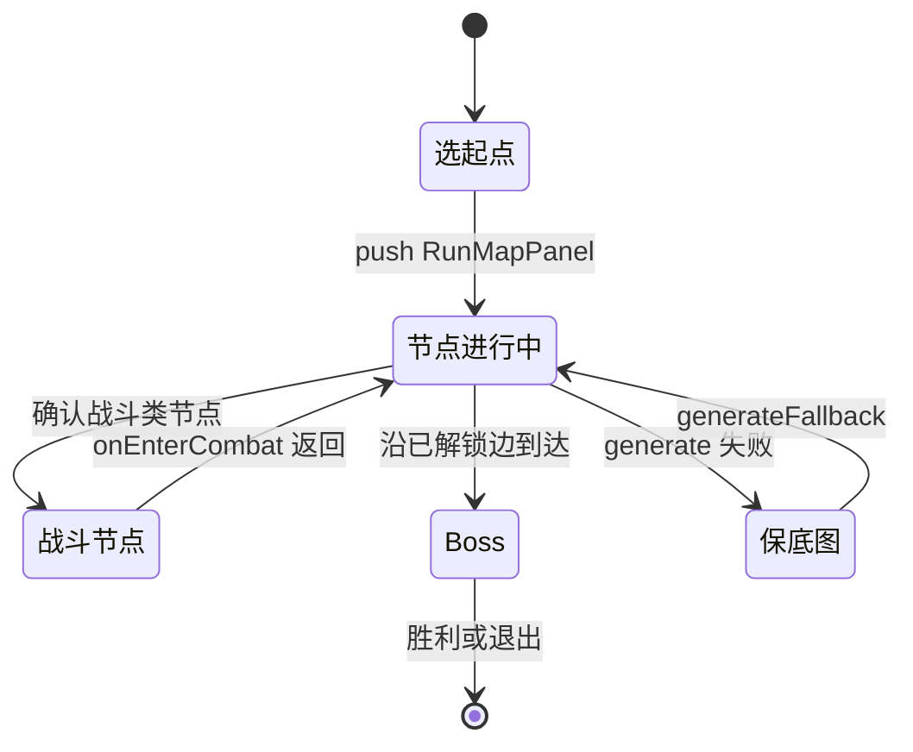

# 论文 Mermaid 图补充设计

> 对照：`论文改写对照-校外稿.md` 中已融入源码叙述的正文  
> 仓库已有：`system-layers.mmd`、`system-sequence.mmd`、`skill-tab-sequence.mmd`（build.ps1 可导出 PNG）  
> 下文为**建议新增**图：解决 Word 稿里“只有图号、段落干、缺流程图”的问题

---

## 一、总览：已有图 vs 建议补图

| 论文章节 | Word 现有/应有 | 仓库 Mermaid | 建议 |
|----------|----------------|--------------|------|
| 4.2 分层 | 图4-1 | system-layers.mmd | 已有，保持 |
| 4.3 时序 | 图4-2 | system-sequence.mmd | 已有；正文需写清 Main→Config→Demo→Bridge |
| 5.1.3 技能链 | 图5-1 | **skill-effect-flow.mmd（新）** | **建议新增**，替代纯文字（1）（2）（3） |
| 5.1.3 / 7.2.2 公式树 | 图5-5 | **formula-tree-flow.mmd（新）** | parseFormula / evaluateFormula 与 AST 示例 |
| 5.2.2 Tab | 图5-2 | skill-tab-sequence.mmd | 已有；与 7.4 截图对照 |
| 6.2 对象池 | 图6-1 | **pool-lifecycle.mmd（新）** | **建议新增**，配合 P95 表 7-6 |
| 6.3 Worker | 图6-2 | **worker-frame-pipeline.mmd（新）** | **建议新增**，说清 prepareFrame 双路径 |
| 3.1.1 / 5.4.1 配表 | 无 | **config-load-sequence.mmd（新）** | 可选，放 5.4.1 一段后 |
| 4.5 容错 | 表4-1 | **fault-degrade-state.mmd（新）** | 可选，状态图比纯表好读 |
| 3.4.3 / 5.2.1 跑图 | 图5-3、图7-2 | 可增 runmap-state.mmd | 见下文第六节 |

---

## 二、优先级（答辩前）

**高（强烈建议导出 PNG 插入 Word）**

1. **图5-1 技能效果执行链** → `thesis/figures/skill-effect-flow.mmd`  
   - 对应 `EffectExecutor.buildSkillCastPlan` 的 pendingSplit/Chain/Pierce 与 bullet 行  
   - 插入位置：5.1.3 节，表5-1 之前或之后  

2. **图6-1 对象池生命周期** → `pool-lifecycle.mmd`  
   - 对应 `BulletPool.get/put` 与 `isObjectPoolEnabled()` 消融  
   - 插入位置：6.2 节，接表 7-6 解读段  

3. **图6-2 Worker 单帧管线** → `worker-frame-pipeline.mmd`  
   - 对应 `CombatDataBridge.prepareFrame`：latestResult / computeSync / dispatchCompute  
   - 插入位置：6.3 节，强调子弹碰撞支路“始终主线程”  

**中（篇幅紧可二选一）**

4. **配表加载时序** → `config-load-sequence.mmd`（3.1.1 或 5.4.1）  
5. **容错状态图** → `fault-degrade-state.mmd`（4.5，与表4-1 并列）  

**低（有截图可不加）**

6. 跑图 DAG 状态图（见第六节草案）  
7. ECS 实体销毁流程图（3.4.1/5.1.1，一段文字即可）  

---

## 三、导出与编号建议

```powershell
cd SurvivorAndFight/thesis
.\build.ps1
# 若 build.ps1 未包含新 mmd，可手动：
# npx -y @mermaid-js/mermaid-cli -i figures/skill-effect-flow.mmd -o figures/skill-effect-flow.png
```

Word 插图编号建议（与现有 Png 目录对齐）：

| 导出 PNG | 建议图题 |
|----------|----------|
| skill-effect-flow.png | 图5-1 技能效果执行链（buildSkillCastPlan） |
| pool-lifecycle.png | 图6-1 子弹对象池 get/put 生命周期 |
| worker-frame-pipeline.png | 图6-2 战斗帧 Worker 与主线程分工 |
| config-load-sequence.png | 图5-4 配表双通道加载时序（可选） |
| fault-degrade-state.png | 图4-7 容错降级四条支路（纵向 flowchart，避免重叠） |
| formula-tree-flow.png | 图5-5 公式树解析与求值（含 (atk+5)*2 示例 AST） |

---

## 四、各图与正文的衔接句（已并入对照稿「如图×-×」段）

> 以下与 `论文改写对照-校外稿.md` 中对应小节 **改写后** 末尾读图段同步，Word 中按「铺垫正文 → 插图 → 图题 → 如图段」粘贴即可。

## 四（备）、各图与正文的衔接句（粘贴 Word 用）

**5.1.3 末（技能链图）**  
图5-1 按源码中 buildSkillCastPlan 的遍历顺序画出：modifier 行只累加 pending 变量，bullet 行才把 splitCount、chainCount、penetration 写入 BulletSpawnSpec 并调用 spawnBulletWithOptions，与表5-1 中 effect 字段映射一致。

**6.2 末（对象池图）**  
图6-1 对应 BulletPool：spawn 时 get(prefabPath) 从桶里 pop，桶空再由 BulletSystem instantiate，回收时 put 前 removeChild，关池消融时 isObjectPoolEnabled() 返回 false 走直连实例化，即表7-6 第4波配置。

**6.3 末（Worker 图）**  
图6-2 对应 CombatDataBridge.prepareFrame：本帧优先消费 latestResult，没有则 computeSync，末尾 dispatchCompute 异步投递；BulletSystem 碰撞支路不进入 Worker，与 combatWorkerLogic.ts 单文件双端共用相呼应。

**4.5 末 / 表4-1 后（容错图4-7）**  
图4-7 为 mindmap：中心「正常运行」向四条分支辐射，每条分支下再分触发、降级、恢复三层，体现「同一目标态下多模块可独立降级又各自回退」的联系；与 ConfigBootstrap、CombatDataBridge、RunMapGenerator、预制体占位对应。

**7.2.2 末（公式树图5-5）**  
图5-5 主链对应 ALLOWED_PATTERN→tokenize→递归下降→FormulaNode→evaluateFormula；示例 AST 展示 (atk+5)*2 的乘号在根、加号在左子树，与 parseFormula 优先级一致。

---

## 五、已有三图的正文衔接（避免“干图”）

| 图号 | 正文应交代的一句话 |
|------|-------------------|
| 图4-1 | 五层单向依赖，SimpleEcsDemo 落在游戏逻辑层作组合根 |
| 图4-2 | 启动 ensureGameConfigLoaded、元菜单 push、onEnterCombat、frameLoop 内 update 与 Worker 回退 |
| 图5-2 | Tab 置 paused、Sync 写回、下一冷却周期 Cast 生效 |

---

## 六、可选：跑图 DAG 状态图草案（runmap-state.mmd）

尚未写入仓库，若 5.2.1 仍偏短可新增：



---

## 七、不宜用 Mermaid 的位置

| 内容 | 建议形式 |
|------|----------|
| 表7-5、7-6 帧率数据 | 保持表格 + 1 段解读，不必画图 |
| 图7-1～7-6 运行截图 | 实拍/预览截图，不用 Mermaid |
| 附录 B 配表字段 | ER 图已有 fig-ch04-04-config-er 可复用 |
| 完整类图 ECS | 待办清单已标非必须，分层图够用 |

---

## 八、与改写对照稿的配合

改写对照稿中已在 5.1.3、6.2、6.3、4.3 等节**正文内**写入与上图一致的实现叙述，插入 Mermaid 后只需加“如图×-× 所示”一句，无需再单独开“源码要点”小节。
